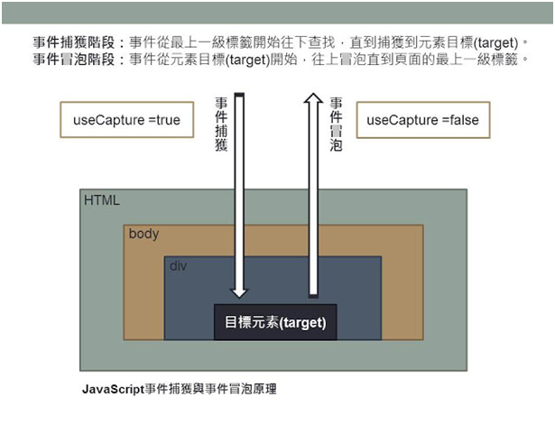

#3. 事件

@(104-1.網站程式設計)[jquery]

---

###事件模型

－ 向內獲取(capturing): 事件在發生時,會由外層先獲取,再向內層發送該事件,早期的netscape瀏覽器採用這種模型
－ 向外冒泡(bubbling): 內層事件發生時,會向外傳發送該事件, IE9之前瀏覽器採取這個模型
－ 現在主要瀏覽器均支援以上二種事件模型
－ 事件處理完成後,若回傳false,可以阻止事件傳遞(stop propagation)



###事件類型(02)

綁定事件的主要方法,可以用`bind()`或`on()`(在jQuery 1.7版之後,[官方推薦](http://blog.jquery.com/2011/11/03/jquery-1-7-released/)使用`on()`,而不要再使用`bind()`了!)

- `bind(type [,data], fn)`: 為一個元素綁定事件
  - `type`:為事件類型, 包括:`blur`, `focus`, `load`, `resize`, `scroll`, `unload`, `click`, `dbclick`, `mousedown`, `mouseup`, `mousemove`, `mouseover`, `mouseout`, `mouseenter`, `mouselevave`, `change`, `select`, `submit`, `keydown`, `keypress`, `keyup`, `error`等
  - `data`:為`event.data`屬性值,做為傳入`fn`時的額外資訊
  - `fn`:事件觸發後的處理函式

  ```javascript
  $("div").bind("click", myclick)
  $("div").bind("click", {val1:10}, myclick)
  ```

**jQuery提供了一些常用的事件綁定的簡寫方法,例如`bind("click",fn)`可以簡寫成`click(fn)`, 可至官方網站查詢。**

###合成事件(05,06,07)

jQuery提供了二個合成事件方法:`hover()`及`toggle()`

- `hover(enter, leave)`: `hover`是組合了`mouseover`及`mouseout`二個事件,簡化其寫法
  ```javascript
  $("#panel").hover(fn1, fn2)
  ```

- `toggle(fn1, fn2, ... fnN)`: `toggle`相當於`click`事件,但它會依序輪流的觸發指定的函式(`fn1`, `fn2`...),若觸發到最後一個,會再輪回第一個。

  ```javascript
  $("#myDiv").toggle(fn1, fn2)
  ```
  **注意: 這個方法在jQuery 1.9版之後被移除,但有一個同名方法,其功能如下述,使用時要特別注意!**
- `toggle()`: 將元素做`hide`及`show`的切換(若為隱藏則顯示出來,若顯示則將將其隱藏)

  ```javascript
  $("#myDiv").toggle()
  ```

###阻止事件傳播及預設行為(08,09)

- `stopPropagation()`: 停止事件繼續向外冒泡或向內獲取

  ```javascript
  $("a").click(function(e){
    ...
    e.stopPropagation()
  })
  ```

- `preventDefault()`:  在HTML DOM中,有許多元素均有其預設事件行為,例如: `<input type="submit" ...>`按下後會向主機提交`form`的內容。若在這類元素中加入自己的事件處理,而在處理過程中想要阻止其預設事件行為(例如當資料驗証有誤時,要阻止向主機提交),即可使用此方法。
  ```javascript
  $("a").click(function(e){
    ...
    e.preventDefault ()
  })
  ```

**除了jQeury提供的這二個方法,若要同時停止傳播,又要阻止預設行為時,只要在處理函式結束時return false,即可達成相同效果,這方式較簡潔,也是常用的寫法!**

###事件參數中的其它事件屬性(10)

事件處理函式中,會傳入一個參數(一般會命名為`event`或`e`),此為事件參數,此參數中有一些有用的屬性及方法可以使用。
前面所介紹的`preventDefault()`及`stopPropagation()`也是屬性事件參數中的方法

- `event.target`: 取得觸發事件者的元素(注意:此為屬性,不是方法)
  ```javascript
  $("a").click(function(e){
    alert(e.target.href) //取得觸發者a元素中的href值
  })

  ```

- `event.pageX/pageY`: 取得觸發當時,游標位於頁面的座標。(原IE是用`event.x()/y()`,而其它瀏覽器是`event.pageX/pageY`,在jQuery中,則統一使用`pageX/pageY`,同時也處理了在不同瀏覽器中對於座標計算的不同) (注意:此為屬性,不是方法)
  ```javascript
  $("a").click(function(e){
    alert(e.pageX()+","+e.pageY())
  })
  ```


- `event.which` 取得滑鼠按一下事件中,所使用的是那一個滑鼠鍵(1=左鍵,2=中鍵,3=右鍵),及若為按鍵盤事件中,所使用的按鍵代碼(a=65...)

###移除事件(11,12,13)
1. 一個元素可以綁定多個事件,而同一事件也可以同時綁定在不同元素上(11)
2. 綁定的事件亦可以用`unbind()`方法移除(12,13)

- `unbind()`: 移除所有綁定的事件(12)
- `unbind(type)`: 移除指定的事件類型(12)
  ```javascript
  $("#btn").unbind("click") //移除click事件
  ```
- `unbind(type, data)`: 若一個元素綁定多個相同類型的事件,而想要移除其中的某個指定事件時,可以在指定事件的當時,保留其事件的參考(`data`),而在移除事件時,將其參考變數傳入即可移除指定的事件!(13)
- `one()`: `one()`方法也是一個綁定事件的方法,但在第一次觸發後會自動移除綁定(14)

###觸發事件(15)
1. 事件的觸發一般是由使用者介面產生,或是由系統產生
2. 若想要在程式中主動觸發事件,可以用`trigger()`方法來達成
3. 亦可利用在綁定事件中的簡寫方法但不帶任何參數,來觸發其事件,例如: `$("#btn").click()`

###使用者自訂事件(16)
1. 利用`bind()`方法可以自行定義事件型態,例如: `$("p").bind("myClick")`
2. 若要觸發自定事件,可以用`trigger()`來觸發,例如: `$("p").trigger("myClick")`

###傳遞資料(17)
在事件觸發時,可以傳入額外參數由事件處理函式接收處理

###綁定多個事件(18)
在元素上要同時綁定多個事件類型(共用同一個處理函式)時,可以簡寫成: 
```javascript
$("p").bind("mouseover mouseout", function(){...} 
```


